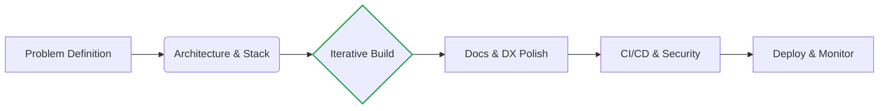

# SAWKIT

**Full‑stack Engineer | Freelance**
*Bridging the gap between Systems, Modern Web, and AI.*

---

## ⚡ About Me

I am a **Tech Polymath** and Freelance Engineer based in **Belgium 🇧🇪**.
I don't just write code; I design complete ecosystems. My approach combines the rigor of **System Administration** with the agility of **Modern Web Development**.

🚀 **My Edge:** Technology evolves, but fundamentals remain. My deep understanding of **Networking & OS internals** (Linux, TCP/IP) allows me to master modern layers (Docker, Next.js, Applied AI) with confidence and precision.

---

## 🚀 Preferred Stack (The "A-Game")

*The technologies I leverage to build scalable, production-grade solutions.*

| Domain | Stack | Approach |
| :--- | :--- | :--- |
| **Front-end** |    | Type-safe Architecture & Server Components. |
| **Styling & UI** |    | Utility-first, Accessible Components & Design-to-Code. |
| **Back-end** |      | Async APIs, ERP Integration & Microservices. |
| **AI & ML** |   | Local Inference, RAG & Model Integration. |
| **Data** |     | **pgvector** embeddings, NoSQL & Caching. |
| **Infra & Cloud** |      | Orchestration, Virtualization, Reverse Proxy & Edge. |
| **OS & SysAdmin** |     | Deep System Administration & Shell Scripting. |
| **IoT & Hardware** |   | Hardware hacking & Network experiments. |
| **Tools** |     | AI-Assisted Dev, API Testing & clean commit history. |

---

## 🏛️ Legacy & Foundations

*Proven technologies I have mastered and can maintain or migrate.*

| Domain | Technologies |
| :--- | :--- |
| **Classic Web** |    |
| **Styling** |   |
| **Scripting** |   |
| **Data** |   |
| **Virtualization** |  |

---

## 🧪 Active Learning & R&D

*Pushing boundaries to define the future of Engineering.*

| Field | Technologies | Goal |
| :--- | :--- | :--- |
| **Mobile** |    | Bridging Cross-platform & Native modules performance. |
| **Systems** |    | High-perf Systems Programming & Cloud Orchestration. |
| **Next-Gen Web** |    | Exploring cutting-edge runtime performance & type-safety. |
| **Cloud Ops** |  | Advanced CI/CD workflows automation. |
| **Adv. AI** |  | Designing complex autonomous Agentic workflows. |

---

## 🎯 Engineering Workflow

> *"Make it work, make it right, make it fast."*

---

### 📫 Availability & Location

 

**Hours:** Weekdays, 9h - 18h (CET/Brussels Time)
 
**Base:** Belgium 🇧🇪
 

